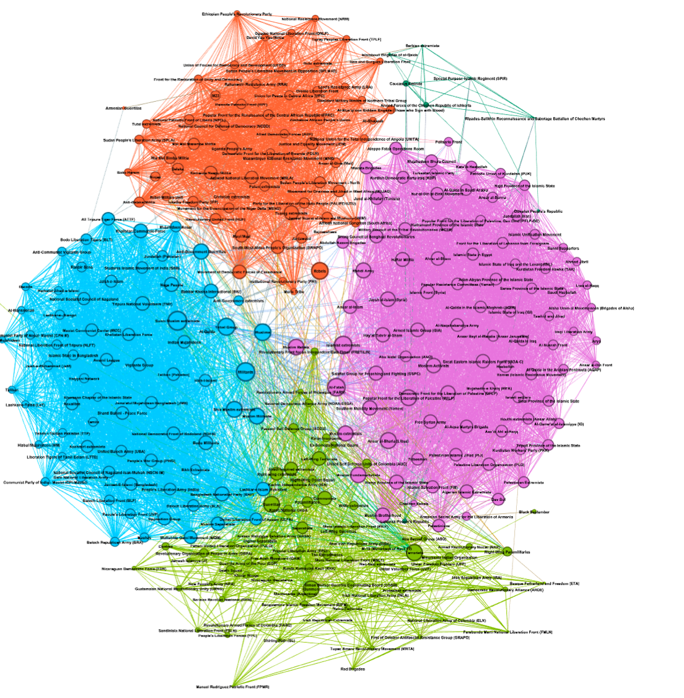
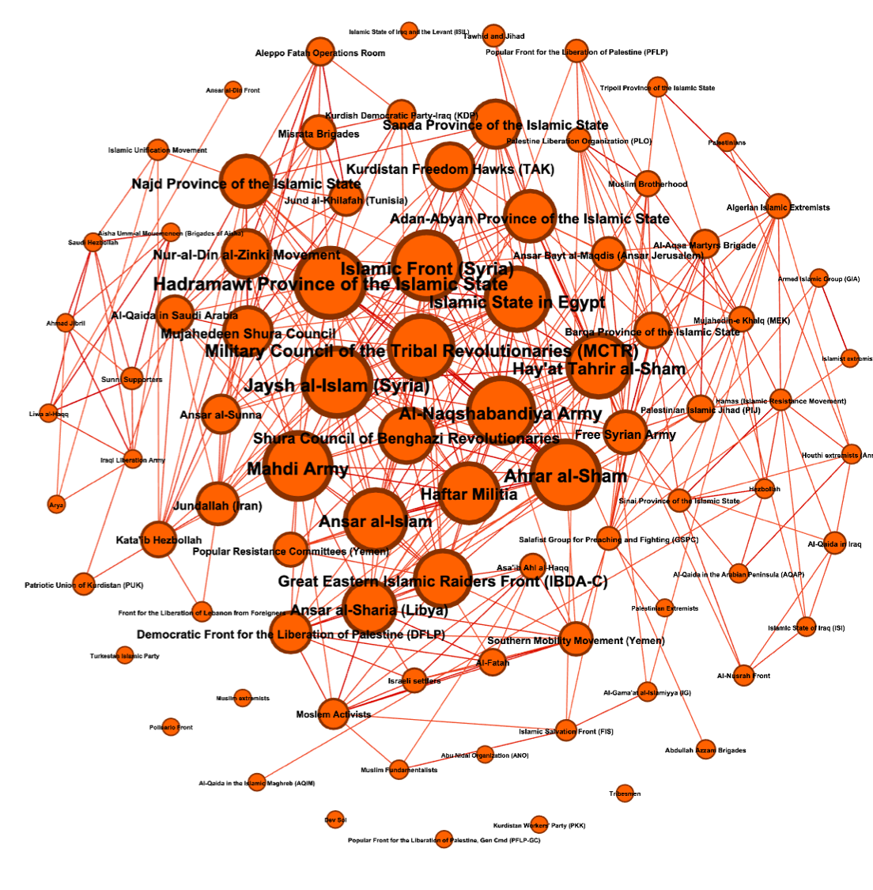
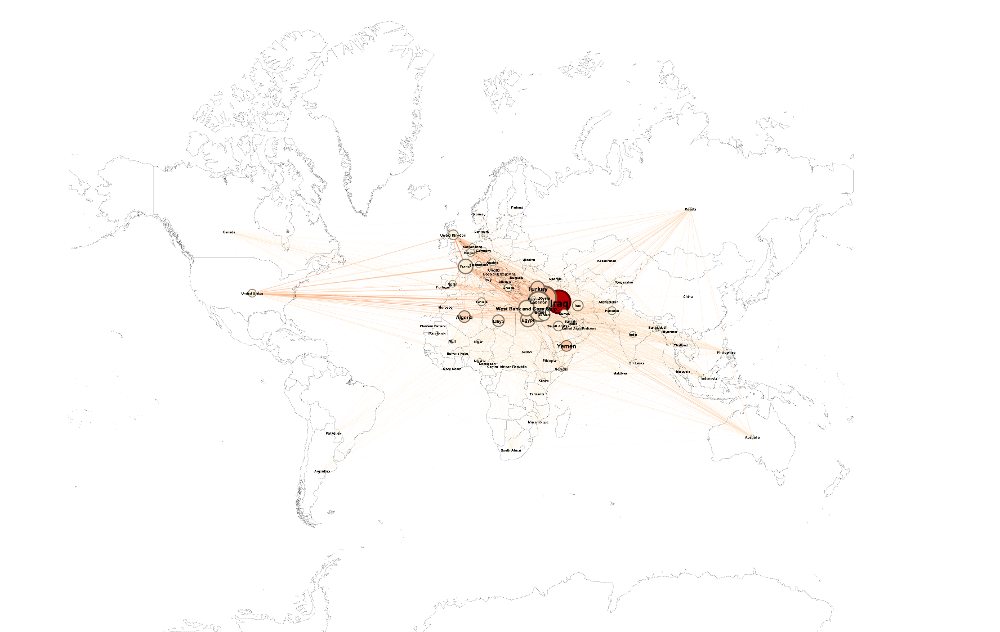
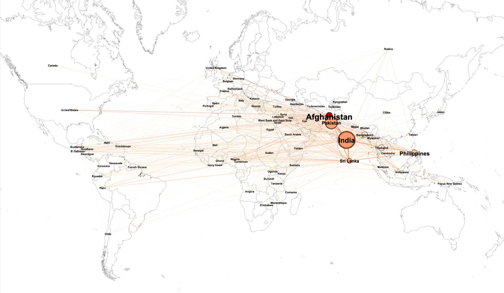
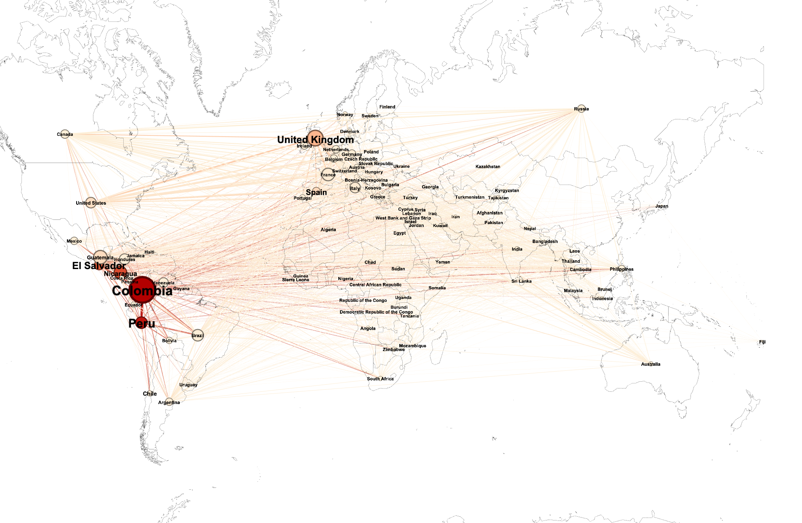
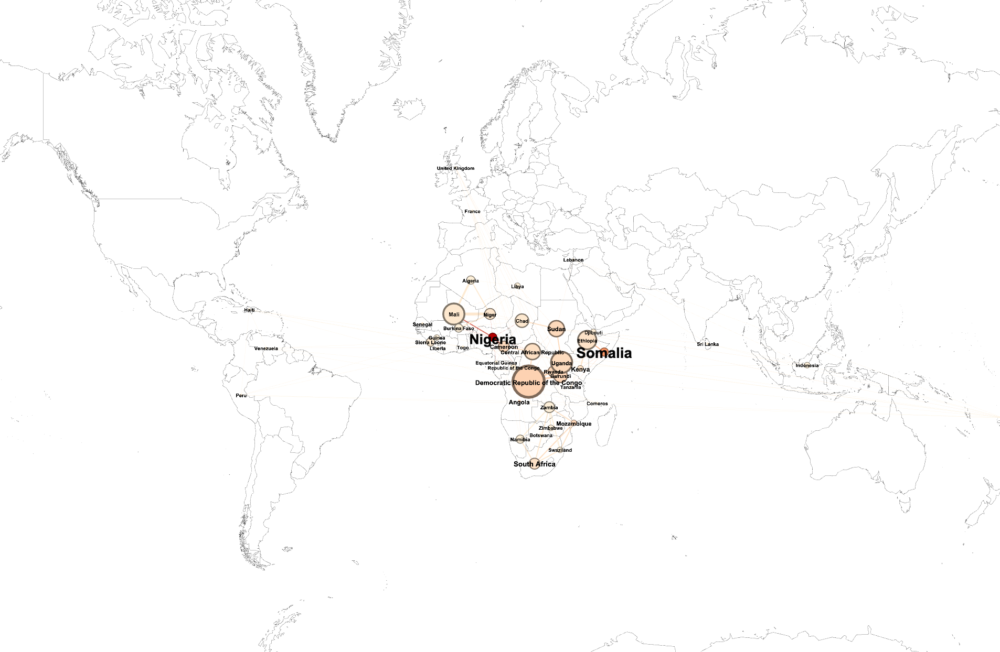

# Implicit Terrorist Networks: A Social Network Analysis of Global Terrorism

__Is there any order in the apparent chaos of the internation terrorist landscape ?__  

Working in collaboration with a team of INRIA researchers, we were able to study the main terrorist networks worldwide, asking ourseleves if they were any similarities between apparently disconnected groups. What we meant by similarities was clearly to be defined in our work. Luckily, we had access to the Global Terrorism Database, a massive database of more than 190,000 domestic and international terrorist events around the world since 1970. Connecting this database with others, we used graph clustering and unsupervised machine learning tools in order to find a latent structure. This was made possible by the introduction of a metric whose purpose was to estimate the distance between groups by taking into account more than thirty factors (geography, similarity of attacks, magnitude, targets...). Bellow are the four main clusters that emerged from our work.

Then, working cluster by cluster, we try to see to what extent was the relations we infered pertinents. Bellow is the "Middle East" Cluster and it main affiliated terrorist networks.

The second step of our work was to study geographical patterns of those clusters. Indeed, eventhough most of the groups in one cluster share geographical similarities, it is not always the case. The outliers are therefore very interesting. We have defined a metric in order to affiliate groups to one or more countries, in a relevant way. Thanks to that, we were then able to observe a geographical visualisation of the networks and to intepret our results:

## Middle East Cluster

## Indian Cluster

## South American Cluster

## African Cluster

Finally, we studied the apparent results (sparsity in African Cluster, Strong dispersal in South American Cluster...) using historical information in order to validate our theories.

The code we used is divided in different parts:
* Data_visualisation is a jupyter notebook we used in a preliminary study of the specificities of terrorist networks.
* Cluster_treatment.ipynb is a jupyter notebook in which we deal with the feature processing, cleaning the data and computing most of the metrics for the clustering.
*  NEO4J_cypher.docx is the list of the NEO4J instructions we used for part of the clustering. The other part was done using Gephi and is not transmitted here.
* Graph and Data Files are,as said, the files with the data in csv of the graph, the nodes and the edges we used.
* Rapport_Final.pdf is a brief summary in french of our work.

Fell free to take a look at the code and to ask me if you have any question !
